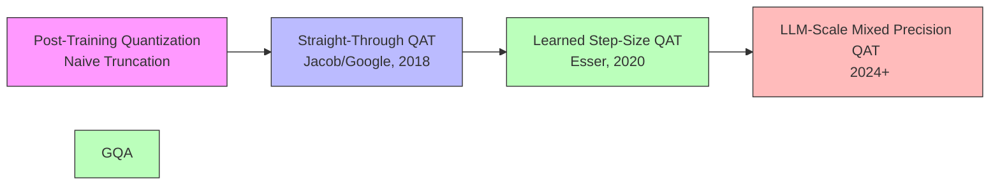
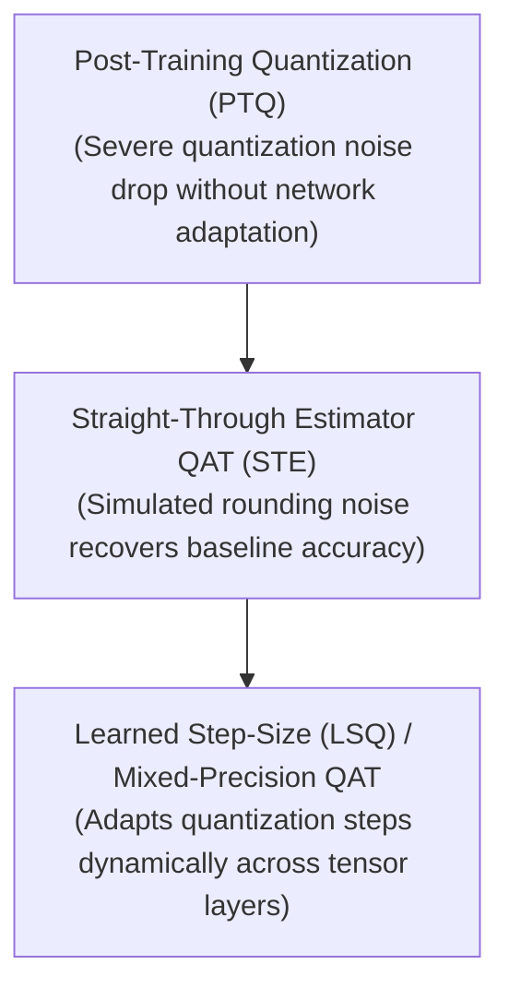

# Awesome-Quantization-Aware-Training

 

## 🌟 Quantization-Aware Training: History, Progression, Variants, & Applications

**Quantization-Aware Training (QAT)** represents a foundational paradigm shift in the hardware-efficient optimization and edge deployment of deep neural networks. Formally pioneered by Jacob et al. (Google) in 2018 ("Quantization and Training of Neural Networks for Efficient Integer-Arithmetic-Only Inference"), QAT established a rigorous framework for simulating numerical precision loss directly during the training graph's forward pass. 

Prior to QAT, the deep learning ecosystem relied almost exclusively on Post-Training Quantization (PTQ), which aggressively clipped FP32 weights down to INT8 after training was complete. This practice caused massive accuracy drops, particularly in compact architectures like MobileNets. QAT inverted this destructive approach, proving that by exposing model weights to **quantization noise during training**, the network can naturally adjust its remaining parameters to retain **near-lossless floating-point accuracy** when compressed to low-precision formats.

---

## 1. The Macro Chronological Evolution

The implementation of neural network quantization has transitioned from naive post-training truncations to backpropagation-compatible simulated precision noise, shifting toward modern mixed-precision tuning and LLM-scale weight-activation co-optimization.

| Feature | Description | Year | Paper |
|---|---|---|---|
| [The Post-Training Truncation Era](pages/post_training_truncation.md) | **Concept:** Models were trained natively using high-precision FP32 or FP16. After training concluded, a separate offline process mapped continuous floating-point values into localized integer formats.  **Limitation:** Created massive mathematical rounding drops and severe accuracy degradation in memory-starved architectures. It failed to account for out-of-distribution outlier activations, rendering ultra-low bit-width deployments non-viable. | Pre-2018 | [Link](#) |
| [The Simulated Noise Revolution (Straight-Through Estimator QAT)](pages/ste_qat.md) | **Concept:** Injected "Fake Quantization" nodes into both weights and activation channels during the forward training pass, allowing the model to experience low-precision rounding errors natively while accumulating parameter adjustments.  **Significance:** Solved the zero-gradient paradox of discrete step-functions by bypassing non-differentiable rounding operators during the backward pass using a Straight-Through Estimator (STE), bridging the gap between hardware constraints and gradient descent. | 2018 | [Link](#) |
| [The Adaptive Scaling Era (Learned Step-Size Quantization / LSQ)](pages/lsq.md) | **Concept:** Rather than relying on rigid, pre-calculated clipping thresholds, LSQ introduced the quantization step-size interval directly as a learnable parameter optimized during backpropagation.  **Significance:** Unlocked stable, ultra-low bit-width architectures (down to INT4 and INT2 combinations) by enabling the model to dynamically reshape its numerical boundaries alongside weight evolution. | 2020 | [Link](#) |

---

## 2. Core Functional & Mathematical Operations

Quantization-Aware Training models utilize continuous numerical scaling to project real numbers into discrete intervals while maintaining a continuous floating-point mirror copy for optimization.

| Operation | Description | Year | Paper |
|---|---|---|---|
| [The Uniform Asymmetric Quantization Operator](pages/uniform_asymmetric_quantization.md) | **Mechanism:** Maps a real floating-point value $r \in [r_{\min}, r_{\max}]$ into an integer range $q \in [q_{\min}, q_{\max}]$ using a scale factor $S$ and an integer zero-point offset $Z$: $$q = \text{clamp}\left( \left\lfloor \frac{r}{S} \right\rceil + Z, q_{\min}, q_{\max} \right)$$ $$S = \frac{r_{\max} - r_{\min}}{q_{\max} - q_{\min}}, \quad Z = \text{round}\left( \frac{-r_{\min}}{S} \right) + q_{\min}$$ | - | [Link](#) |
| [The Straight-Through Estimator (STE)](pages/ste.md) | **Mechanism:** Because the standard rounding operator $\lfloor \cdot \rceil$ is a step function with a derivative of zero almost everywhere, backpropagation would completely stall. The STE replaces the non-differentiable gradient with an identity mapping matrix during the backward pass: $$\frac{\partial q}{\partial r} \approx 1$$ This forces the high-precision floating-point master weights to absorb fine-grained gradient updates while the forward pass evaluates strictly simulated low-precision outcomes. | - | [Link](#) |

---

## 3. High-Capacity Architectural & Calibration Classes

Depending on extreme edge storage profiles or token context demands, precision modeling scales across specialized variants.

| Architecture Class | Description | Year | Paper |
|---|---|---|---|
| [Weight-Only Quantization vs. Joint Weight-Activation QAT](pages/weight_only_vs_joint.md) | **The Shift:** Weight-Only QAT focuses exclusively on compressing stationary static parameter states (e.g., INT4 weights) while retaining dynamic FP16 calculations. Joint Weight-Activation QAT targets high-throughput contexts by quantizing both parameters and moving runtime activations (e.g., INT8/INT8), requiring meticulous balancing due to unpredictable runtime outliers. | - | [Link](#) |
| [Non-Uniform & Outlier-Aware QAT (NormalFloat / Outlier-Protected Tuning)](pages/non_uniform_qat.md) | **The Shift:** Modern foundation architectures exhibit massive activation spikes in isolated channels. Modern QAT variants mathematically isolate these critical outlier tokens into protected high-precision islands (FP16), while forcing the remaining 99% of standard background distribution channels into dense low-precision blocks. | - | [Link](#) |

---

## 4. Production Engineering Challenges & Hardware Solutions

Executing multi-node QAT pipelines across massive parameter systems introduces deep optimization blocks and compilation constraints.

| Challenge | Problem & Mitigation | Year | Paper |
|---|---|---|---|
| [The Float-Integer Master Weight Instability Loop](pages/weight_instability_loop.md) | **The Problem:** Because gradient updates are incredibly fine-grained, modifying floating-point master weights by fractions may not alter their discrete quantized equivalent in the forward pass. This creates stuck gradients and oscillating loss patterns during deep fine-tuning.  **Mitigation:** Implementing **Stochastic Rounding** or utilizing progressive learning rate warm-up schedules coupled with weight decay regularization to gently smooth out parameter jumps. | - | [Link](#) |
| [The Hardware Kernel Generation Divergence](pages/hardware_kernel_divergence.md) | **The Problem:** Simulating quantization in framework tools like PyTorch or TensorFlow does not automatically translate into real-world inference speedups. If target hardware lack explicit Tensor Core support for mixed operations (e.g., INT4 matrix math multiplication), the network will suffer execution delays.  **Mitigation:** Deploying custom compilation backends like **TensorRT**, **ONNX Runtime**, or **Apache TVM**. These compile the trained fake-quantization operators into highly optimized, native structural INT8 integer execution layers. | - | [Link](#) |

---

## 5. Frontier Real-World AI Infrastructure Applications

| Application | Description | Year | Paper |
|---|---|---|---|
| [Ultra-Low Latency Mobile and Edge Computer Vision (MobileNet / YOLO)](pages/edge_cv.md) | **Application:** Powers real-world processing engines on autonomous robotics and smart mobile platforms. QAT allows dense image object tracking matrices to compile directly onto low-power Edge TPUs and NPU chips without breaking safety thresholds. | - | [Link](#) |
| [On-Device Foundation Language Modeling (LLM-QAT / Edge Assistants)](pages/llm_qat.md) | **Application:** Drives localized on-device agent execution. Applying specialized QAT to compact 1B–8B parameter networks compresses massive VRAM demands down into consumer-tier mobile hardware storage budgets. | - | [Link](#) |
| [High-Throughput Data Center serving (FP8 Inference Clusters)](pages/fp8_inference.md) | **Application:** Minimizes cloud operating overhead across distributed serving grids. Enterprise networks leverage FP8-focused QAT frameworks to double generation throughput boundaries while keeping visual or textual fidelity identical to baseline cluster states. | - | [Link](#) |

---

## References
1. Jacob, B., et al. (2018). Quantization and training of neural networks for efficient integer-arithmetic-only inference. *IEEE Conference on Computer Vision and Pattern Recognition (CVPR)*.
2. Esser, S. K., et al. (2020). Learned step-size quantization. *International Conference on Learning Representations (ICLR)*.
3. Gholami, A., et al. (2022). A survey of quantization methods for efficient neural network inference. *Low-Power Computer Vision*.

---

To advance this documentation repository, scaling architecture, or MLOps automation pipeline, consider exploring these adjacent development pathways:

##  Star History

<a href="https://www.star-history.com/?repos=ishandutta2007%2FQuantization-Aware-Training&type=date&legend=bottom-right">
<picture>
<source media="(prefers-color-scheme: dark)" srcset="https://api.star-history.com/chart?repos=ishandutta2007/Quantization-Aware-Training&type=date&theme=dark&legend=bottom-right" />
<source media="(prefers-color-scheme: light)" srcset="https://api.star-history.com/chart?repos=ishandutta2007/Quantization-Aware-Training&type=date&legend=bottom-right" />

</picture>
</a>

