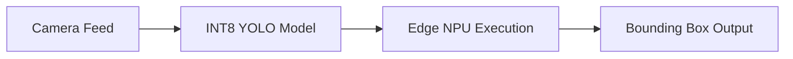

# Ultra-Low Latency Mobile and Edge Computer Vision

## Overview

QAT powers real-world processing engines on autonomous robotics and smart mobile platforms. For models like MobileNet and YOLO, QAT allows dense image object tracking matrices to compile directly onto low-power Edge TPUs and NPU chips without breaking safety thresholds.

## Application

By leveraging INT8/INT4 precision, these models achieve real-time latency and massive energy savings, enabling untethered operation.

## Diagram

