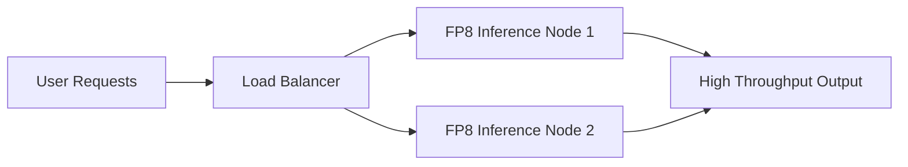

# High-Throughput Data Center Serving

## Overview

QAT minimizes cloud operating overhead across distributed serving grids. Enterprise networks leverage FP8-focused QAT frameworks to double generation throughput boundaries while keeping visual or textual fidelity identical to baseline cluster states.

## Application

Large-scale clusters (like H100s) utilize FP8 precision natively to maximize token generation per watt, pushing the frontier of Data Center serving economics.

## Diagram

