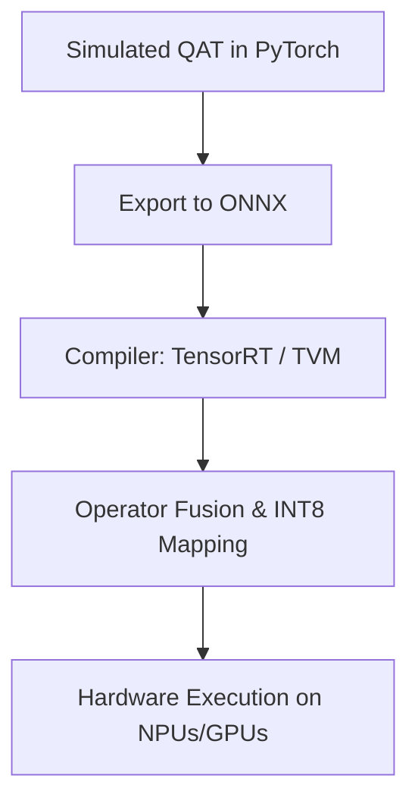

# The Hardware Kernel Generation Divergence

## Overview

Simulating quantization in framework tools like PyTorch or TensorFlow does not automatically translate into real-world inference speedups. If target hardware lacks explicit Tensor Core support for mixed operations (e.g., INT4 matrix math multiplication), the network will suffer execution delays.

## Mitigation

Deploying custom compilation backends like **TensorRT**, **ONNX Runtime**, or **Apache TVM**. These compile the trained fake-quantization operators into highly optimized, native structural INT8 integer execution layers.

## Diagram

