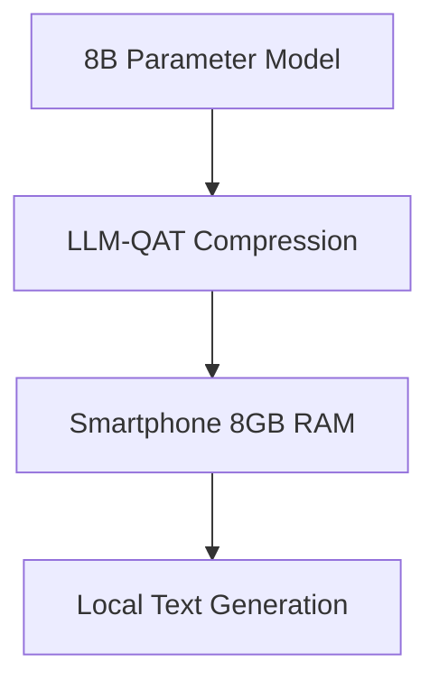

# On-Device Foundation Language Modeling

## Overview

QAT drives localized on-device agent execution. Applying specialized QAT to compact 1B–8B parameter networks compresses massive VRAM demands down into consumer-tier mobile hardware storage budgets.

## Application

This enables powerful Edge Assistants that run privately and autonomously without relying on cloud APIs, transforming modern smartphones into AI hubs.

## Diagram

