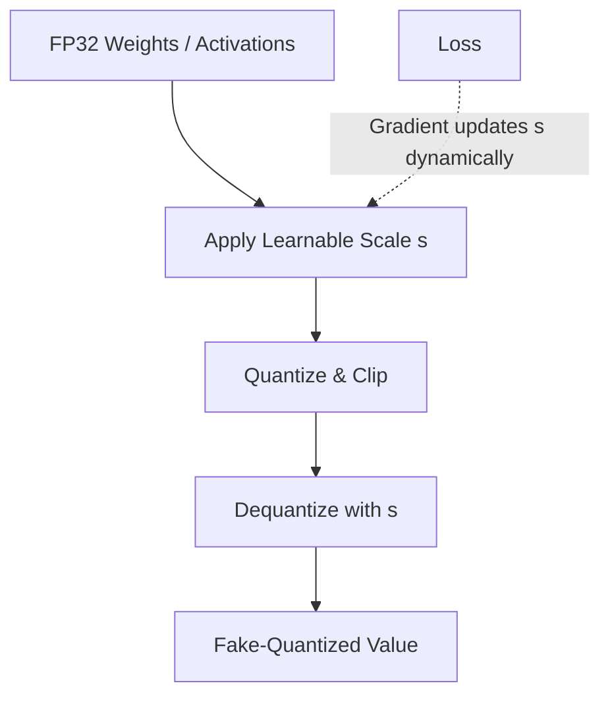

# The Adaptive Scaling Era (Learned Step-Size Quantization / LSQ)

## Overview

Learned Step-Size Quantization (LSQ) introduced the quantization step-size interval directly as a learnable parameter optimized during backpropagation, rather than relying on rigid, pre-calculated clipping thresholds.

## Significance

This unlocked stable, ultra-low bit-width architectures (down to INT4 and INT2 combinations) by enabling the model to dynamically reshape its numerical boundaries alongside weight evolution.

## Diagram

