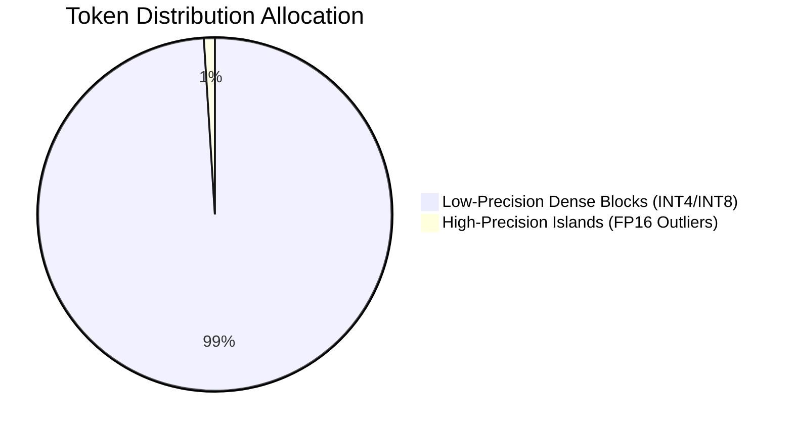

# Non-Uniform & Outlier-Aware QAT

## Overview

Modern foundation architectures exhibit massive activation spikes in isolated channels. Modern QAT variants mathematically isolate these critical outlier tokens into protected high-precision islands (FP16), while forcing the remaining 99% of standard background distribution channels into dense low-precision blocks.

## Approach

Techniques like NormalFloat and Outlier-Protected Tuning ensure that the model retains performance by not overly penalizing the few essential features that drive model predictions.

## Diagram

