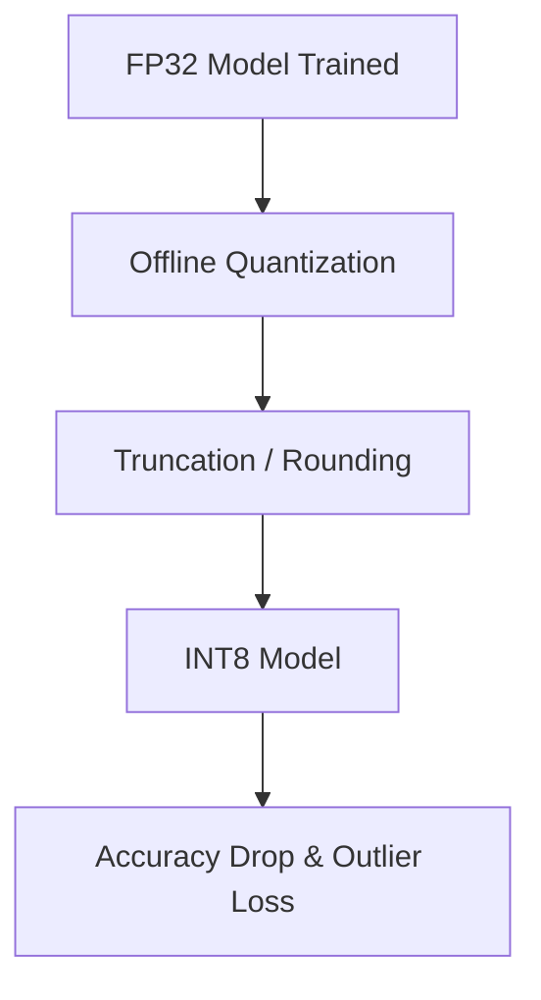

# The Post-Training Truncation Era

## Overview

In the early days of neural network deployment, Post-Training Quantization (PTQ) was the dominant method for compression. Models were trained natively using high-precision FP32 or FP16. After training concluded, a separate offline process mapped continuous floating-point values into localized integer formats.

## Limitations

This approach created massive mathematical rounding drops and severe accuracy degradation in memory-starved architectures. It failed to account for out-of-distribution outlier activations, rendering ultra-low bit-width deployments non-viable.

## Diagram

