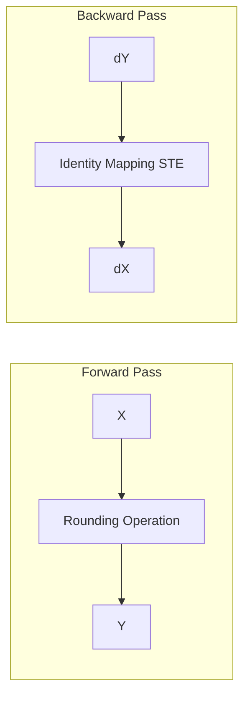

# The Straight-Through Estimator (STE)

## Overview

The standard rounding operator is a step function with a derivative of zero almost everywhere, which would cause backpropagation to completely stall. The Straight-Through Estimator (STE) is a technique that replaces the non-differentiable gradient with an identity mapping matrix during the backward pass.

## Mechanism

This forces the high-precision floating-point master weights to absorb fine-grained gradient updates while the forward pass evaluates strictly simulated low-precision outcomes.

## Diagram

