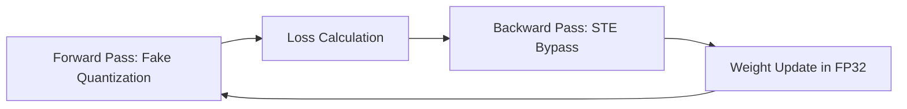

# The Simulated Noise Revolution (Straight-Through Estimator QAT)

## Overview

Quantization-Aware Training (QAT) using the Straight-Through Estimator (STE) revolutionized model compression by injecting fake quantization nodes during the forward pass. This allowed the model to experience low-precision rounding errors natively while accumulating parameter adjustments.

## Significance

It solved the zero-gradient paradox of discrete step-functions by bypassing non-differentiable rounding operators during the backward pass using a Straight-Through Estimator (STE), bridging the gap between hardware constraints and gradient descent.

## Diagram

