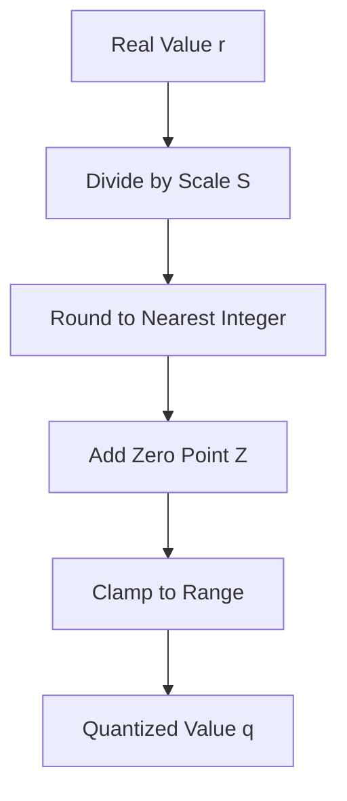

# The Uniform Asymmetric Quantization Operator

## Overview

The Uniform Asymmetric Quantization Operator maps a real floating-point value into an integer range using a scale factor and an integer zero-point offset. This allows for representing asymmetric distributions (e.g., ReLU activations) more effectively than symmetric quantization.

## Mathematics

The transformation is defined as:

$$q = \text{clamp}\left( \left\lfloor \frac{r}{S} \right\rceil + Z, q_{\min}, q_{\max} \right)$$

Where $S$ is the scale and $Z$ is the zero-point.

## Diagram

