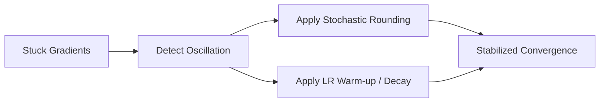

# The Float-Integer Master Weight Instability Loop

## Overview

Because gradient updates are incredibly fine-grained, modifying floating-point master weights by fractions may not alter their discrete quantized equivalent in the forward pass. This creates stuck gradients and oscillating loss patterns during deep fine-tuning.

## Mitigation

Implementing **Stochastic Rounding** or utilizing progressive learning rate warm-up schedules coupled with weight decay regularization gently smooths out parameter jumps and stabilizes the training process.

## Diagram

