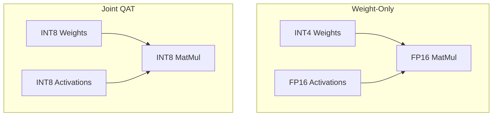

# Weight-Only Quantization vs. Joint Weight-Activation QAT

## Overview

Weight-Only QAT focuses exclusively on compressing stationary static parameter states (e.g., INT4 weights) while retaining dynamic FP16 calculations. 

Joint Weight-Activation QAT targets high-throughput contexts by quantizing both parameters and moving runtime activations (e.g., INT8/INT8). This requires meticulous balancing due to unpredictable runtime outliers.

## Diagram

